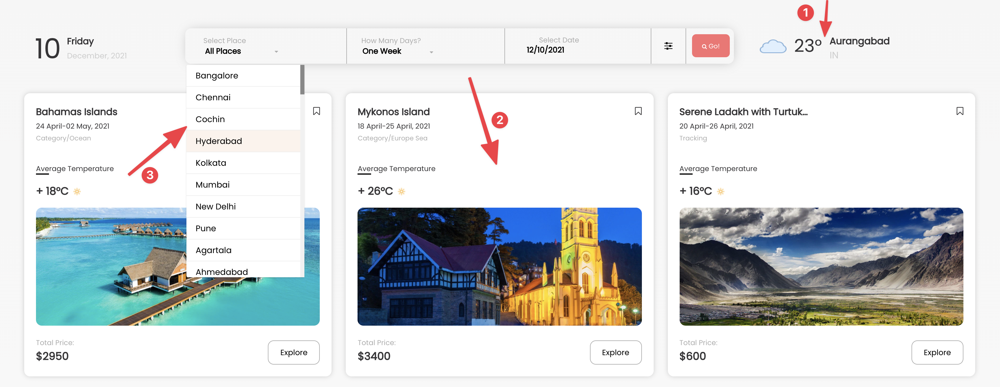

# [Dynamic Weather Website](https://weather-site-kaif.netlify.app/)

This is Responsive Dynamic Weather Website Assignment Created With Pure HTML/CSS & JS with APIs.

---

### Website View

---

## Requirements

- Integrate any 3rd party free weather API
- Populate City list with API
- Places to visit with API
- On change of city name in the dropdown update the weather details as highlighted in screenshot ( Point no. 1)
- Display list of all places to visit in form of card view as highlighted in screenshot ( Point 3 )
- Populate the Indian City with above listed API and render it in dropdown as highlighted in screenshot ( Point 2 )

---

### Demo Screenshot

